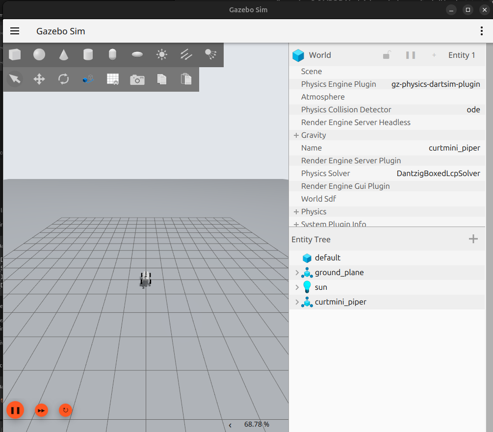
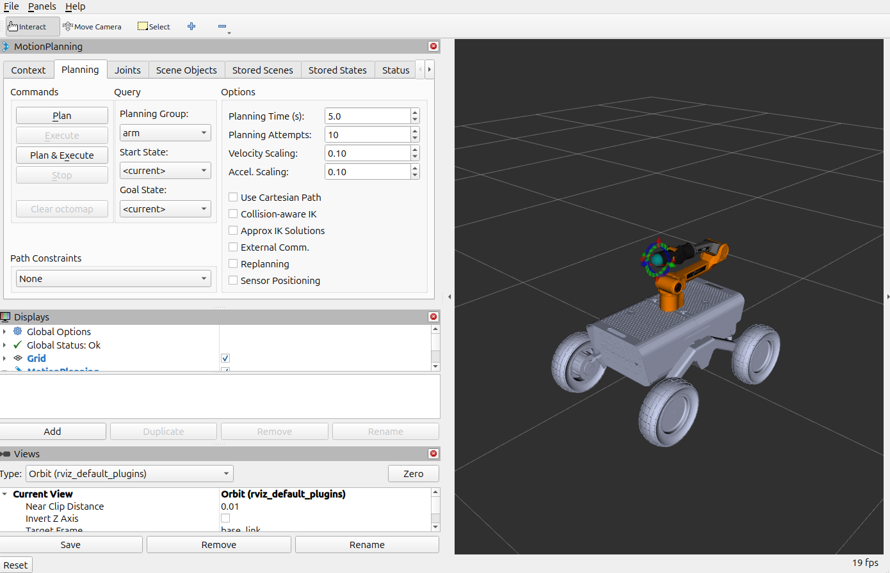

# Curtmini Piper gz sim (Gazebo Harmonic Simulation)

<table>
  <tr>
    <td width="50%" align="center">
      
    </td>
    <td width="50%" align="center">
      
    </td>
  </tr>
  <tr>
    <td align="center">Gazebo harmonics</td>
    <td align="center">RviZ/Moveit</td>
  </tr>
</table>

## Build the package

Clone the dependency repos using vcs tools. From the ROS 2 Workspace:
```sh
vcs import src < src/curtmini_piper_gz_sim/dependencies.repos
```

From the ROS workspace:
```sh
colcon build --packages-up-to curtmini_piper_gz_sim
```

Upstream ROS packages, from the dependencies repos:
- [curt_mini](https://github.com/ipa-may/curt_mini/tree/main/curt_mini) 
  - curt_mini_description
  - curt_mini_teleop
- [curtmini_piper](https://github.com/ipa-may/curtmini_piper)
  - curtmini_piper_description
  - curtmini_piper_moveit_config
- [agx_arm_urdf](https://github.com/ipa-may/agx_arm_urdf)
  - agx_arm_urdf


## Run the package

Start Gazebo Harmonic, the simulated base and arm controllers, MoveIt, and
RViz:

```bash
ros2 launch curtmini_piper_gz_sim simulation.launch.py
```

The simulation uses one Gazebo-owned controller manager for both the Curt Mini
base and Piper arm. It publishes simulation time on `/clock`, IMU data on
`/imu/data`, wheel odometry on `/base_controller/odom`, and the combined robot
state on `/joint_states`.

Run without Gazebo and RViz windows for headless testing:

```bash
ros2 launch curtmini_piper_gz_sim simulation.launch.py \
  gui:=false use_rviz:=false
```

Joystick teleoperation is disabled by default. Enable it with
`start_joystick:=true`. Mount and TCP arguments are the same as the real robot
bringup.


## Teleoperate the simulated robot with a keyboard

Start the robot in the mapping world:

```sh
ros2 launch curtmini_piper_gz_sim simulation.launch.py \
  world:=curtmini_piper_map
```

In a second terminal, activate the state broadcaster and mobile-base
controller after the robot has spawned:

```sh
ros2 control set_controller_state joint_state_broadcaster active
ros2 control set_controller_state base_controller active
ros2 control list_controllers
```

`joint_state_broadcaster` and `base_controller` should both be `active`.

In a third terminal, start keyboard teleoperation:

```sh
ros2 run teleop_twist_keyboard teleop_twist_keyboard --ros-args \
  -p stamped:=true \
  -p frame_id:=base_link \
  -r cmd_vel:=/base_controller/cmd_vel
```

Keep this terminal focused while driving. Use `i` and `,` to drive forward
and backward, `j` and `l` to rotate, and `k` to stop.


## Available topics

```sh
ros2 topic list
```
```text
/arm_controller/controller_state
/arm_controller/joint_trajectory
/arm_controller/transition_event
/attached_collision_object
/base_controller/cmd_vel
/base_controller/cmd_vel_out
/base_controller/odom
/base_controller/transition_event
/clock
/collision_object
/controller_manager/activity
/controller_manager/introspection_data/full
/controller_manager/introspection_data/names
/controller_manager/introspection_data/values
/diagnostics
/display_contacts
/display_planned_path
/dynamic_joint_states
/imu/data
/joint_state_broadcaster/transition_event
/joint_states
/monitored_planning_scene
/parameter_events
/pipeline_state
/planning_scene
/planning_scene_world
/recognized_object_array
/robot_description
/robot_description_semantic
/rosout
/rviz_moveit_motion_planning_display/robot_interaction_interactive_marker_topic/feedback
/rviz_moveit_motion_planning_display/robot_interaction_interactive_marker_topic/update
/tf
/tf_static
/trajectory_execution_event
```
