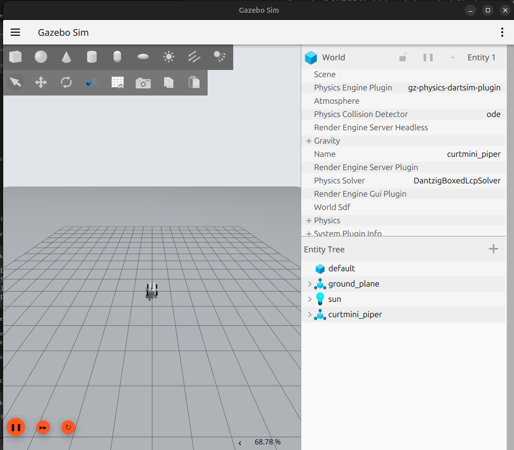
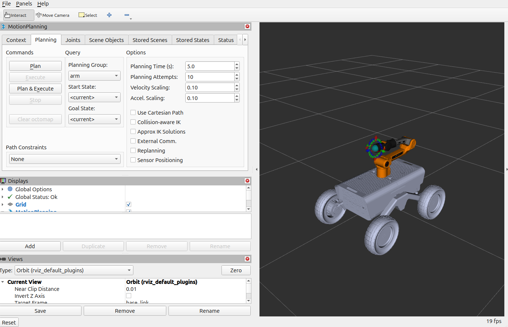

# Curtmini Piper gz sim (Gazebo Harmonic Simulation)

<table>
  <tr>
    <td width="50%" align="center">
      
    </td>
    <td width="50%" align="center">
      
    </td>
  </tr>
  <tr>
    <td align="center">Gazebo Harmonic</td>
    <td align="center">RViz/MoveIt</td>
  </tr>
</table>

## Build the package

Clone the dependency repos with `vcs` from the ROS workspace root. This
example uses the checkout layout in this workspace; adjust the path to
`dependencies.repos` if you cloned the simulator elsewhere:

```bash
vcs import src < src/curtmini_piper_simulation/curtmini_piper_gz_sim/dependencies.repos
```

Build and source the workspace:

```bash
colcon build --packages-up-to curtmini_piper_gz_sim
source install/setup.bash
```

Upstream ROS packages from `dependencies.repos` include:

- [curt_mini](https://github.com/ipa-may/curt_mini/tree/main/curt_mini)
  - curt_mini_description
  - curt_mini_teleop
- [curtmini_piper](https://github.com/ipa-may/curtmini_piper)
  - curtmini_piper_description
  - curtmini_piper_moveit_config
- [agx_arm_urdf](https://github.com/ipa-may/agx_arm_urdf)
  - agx_arm_urdf
- [neo_gz_worlds](https://github.com/ipa-may/neo_gz_worlds)
  - neo_gz_worlds

## Run the package

Start Gazebo Harmonic, the simulated base and arm controllers, MoveIt, and
RViz:

```bash
ros2 launch curtmini_piper_gz_sim simulation.launch.py
```

The simulation uses one Gazebo-owned controller manager for both the Curt Mini
base and Piper arm. The launch starts the base and arm controllers and the
`joint_state_broadcaster`. Check that all three are active with
`ros2 control list_controllers`; `/joint_states` requires the broadcaster.

Set the startup pose in `config/initial_state.yaml`: `base.x`, `base.y`, and
`base.z` are metres, `base.orientation` is one rotation around Z in radians,
and the six `arm.piper_joint*` values are radians. The launch validates every
joint against the Piper's position limits before starting Gazebo. From the
simulator repository root, pass the source file to a local ROS launch so edits
take effect without rebuilding the package:

```bash
ros2 launch curtmini_piper_gz_sim simulation.launch.py \
  initial_state_file:=$(pwd)/config/initial_state.yaml
```

The launch defaults to the installed copy of that file when no path is given.
The Docker service bind-mounts the simulator's source `config` directory over
the installed copy, so editing the YAML and restarting `gz-sim` applies a new
startup pose.

Arm, TCP, and lidar mounts belong to `curtmini_piper_description`. Revision
`23323e3` and later of that repository read them from
`curtmini_piper_description/config/geometry.yaml`. The current
`dependencies.repos` and `docker/dependencies/kilted.repos` pin an older
revision without that file; a fresh import or Docker image therefore uses
the mount defaults in that revision's Xacros. The Docker bind mount of the
description's `config` directory does not change those older Xacro defaults.

`config/moveit_controllers.yaml` sets MoveIt's
`trajectory_execution.allowed_start_tolerance` to `0.0`. This skips MoveIt's
check that a trajectory starts at the current joint positions. Keep the
`joint_state_broadcaster` active so MoveIt receives joint states for planning.
For a host installation, rebuild this package after changing the controller
YAML; Docker bind-mounts the simulator's `config` directory, so a service
restart applies that YAML there.

Run without Gazebo and RViz windows for headless testing:

```bash
ros2 launch curtmini_piper_gz_sim simulation.launch.py \
  gui:=false use_rviz:=false
```

Select a world from `neo_gz_worlds` by name, without a full path:

```bash
ros2 launch curtmini_piper_gz_sim simulation.launch.py \
  world:=neo_workshop
```

Other installed options include `neo_office_empty`, `neo_workshop_2`, and
`office_harmonic_02`. The `world` argument searches this simulator's packaged
worlds first, then `neo_gz_worlds`; an explicit file path also works. The Neo
world files do not load the sensor systems used by this simulator's worlds, so
lidar and IMU data may be unavailable in them.

Joystick teleoperation is disabled by default. Enable it with
`start_joystick:=true`.

## Teleoperate the simulated robot with a keyboard

Start the robot in the mapping world:

```sh
ros2 launch curtmini_piper_gz_sim simulation.launch.py \
  world:=curtmini_piper_map
```

In a second sourced terminal, check the controllers after the robot has
spawned:

```sh
ros2 control list_controllers
```

The launch attempts to activate `joint_state_broadcaster`, `base_controller`,
and `arm_controller`. It allows 30 seconds for a controller switch and 40
seconds for its service response on the host, in Docker, and in CI. If the
state broadcaster is still `inactive` after a startup timeout, retry its
activation:

```sh
ros2 control switch_controllers --activate joint_state_broadcaster
```

`base_controller` must be `active` for keyboard driving.

In a third terminal, start keyboard teleoperation:

```sh
ros2 run teleop_twist_keyboard teleop_twist_keyboard --ros-args \
  -p stamped:=true \
  -p frame_id:=base_link \
  -r cmd_vel:=/base_controller/cmd_vel
```

Keep this terminal focused while driving. Use `i` and `,` to drive forward
and backward, `j` and `l` to rotate, and `k` to stop.

## Key topics

Use `ros2 topic list` to inspect the running simulation. Key topics are
`/clock` for simulation time, `/scan` for the Hokuyo lidar when the world loads
Gazebo's sensor system and `use_hokuyo:=true`, `/joint_states` when
`joint_state_broadcaster` is active,
`/base_controller/odom` for wheel odometry, and
`/arm_controller/controller_state` for arm-controller feedback. The launch also
configures an `/imu/data` bridge; IMU data requires a working Gazebo sensor.
